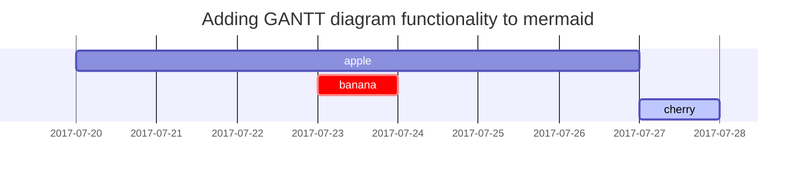

Github로 개인 블로그를 개설했다!

앞으로 개인적으로 공부한 내용과 아카이빙하고 싶은 정보, 다양한 생각을 이곳에 포스팅하려고 한다.

---


여기서부터는 블로그에 이미지, 비디오, 수식 등이 잘 랜더링 되는지 확인하기 위한 테스트 내용들이다.
[Chirpy 예시 포스팅](https://chirpy.cotes.page/posts/text-and-typography/)에서 대부분의 내용들을 가져왔다.


## Headings

<!-- markdownlint-capture -->
<!-- markdownlint-disable -->
# H1 — heading
{: .mt-4 .mb-0 }

## H2 — heading
{: data-toc-skip='' .mt-4 .mb-0 }

### H3 — heading
{: data-toc-skip='' .mt-4 .mb-0 }

#### H4 — heading
{: data-toc-skip='' .mt-4 }
<!-- markdownlint-restore -->

## Paragraph

Quisque egestas convallis ipsum, ut sollicitudin risus tincidunt a. Maecenas interdum malesuada egestas. Duis consectetur porta risus, sit amet vulputate urna facilisis ac. Phasellus semper dui non purus ultrices sodales. Aliquam ante lorem, ornare a feugiat ac, finibus nec mauris. Vivamus ut tristique nisi. Sed vel leo vulputate, efficitur risus non, posuere mi. Nullam tincidunt bibendum rutrum. Proin commodo ornare sapien. Vivamus interdum diam sed sapien blandit, sit amet aliquam risus mattis. Nullam arcu turpis, mollis quis laoreet at, placerat id nibh. Suspendisse venenatis eros eros.

## Lists

### Ordered list

1. Firstly
2. Secondly
3. Thirdly

### Unordered list

- Chapter
  - Section
    - Paragraph

### ToDo list

- [ ] Job
  - [x] Step 1
  - [x] Step 2
  - [ ] Step 3

### Description list

Sun
: the star around which the earth orbits

Moon
: the natural satellite of the earth, visible by reflected light from the sun

## Block Quote

> This line shows the _block quote_.

## Prompts

<!-- markdownlint-capture -->
<!-- markdownlint-disable -->
> An example showing the `tip` type prompt.
{: .prompt-tip }

> An example showing the `info` type prompt.
{: .prompt-info }

> An example showing the `warning` type prompt.
{: .prompt-warning }

> An example showing the `danger` type prompt.
{: .prompt-danger }
<!-- markdownlint-restore -->

## Tables

| Company                      | Contact          | Country |
| :--------------------------- | :--------------- | ------: |
| Alfreds Futterkiste          | Maria Anders     | Germany |
| Island Trading               | Helen Bennett    |      UK |
| Magazzini Alimentari Riuniti | Giovanni Rovelli |   Italy |

## Links

<http://127.0.0.1:4000>

## Footnote

Click the hook will locate the footnote[^footnote], and here is another footnote[^fn-nth-2].

## Inline code

This is an example of `Inline Code`.

## Filepath

Here is the `/path/to/the/file.extend`{: .filepath}.

## Code blocks

### Common

```text
This is a common code snippet, without syntax highlight and line number.
```

### Specific Language

#### With line numbers

```bash
if [ $? -ne 0 ]; then
  echo "The command was not successful.";
  #do the needful / exit
fi;
```

#### Without line numbers
```bash
if [ $? -ne 0 ]; then
  echo "The command was not successful.";
  #do the needful / exit
fi;
```
{: .nolineno }

### Specific filename

```cpp
#include <iostream>
int main() {
    std::cout << "Hello, world!" << std::endl;
    return 0;
}
```
{: file='example_hello_world.cpp'}

### Liquid Codes display


```liquid

  This product's title contains the word Pack.

```


## Mathematics

The mathematics powered by [**MathJax**](https://www.mathjax.org/):

$$
e^{i\phi} + 1 = 0
$$

$$
\begin{equation}
  \sum_{n=1}^\infty 1/n^2 = \frac{\pi^2}{6}
  \label{eq:example_label_here}
\end{equation}
$$

We can reference the equation as \eqref{eq:example_label_here}.

When $a \ne 0$, there are two solutions to $ax^2 + bx + c = 0$ and they are

$$ x = {-b \pm \sqrt{b^2-4ac} \over 2a} $$


Example inline math

1. \$$ \nabla \cdot \mathbf{E} = \frac{\rho}{\varepsilon_0} $$
2. \$$ \nabla \cdot \mathbf{B} = 0 $$
3. \$$ \nabla \times \mathbf{E} = -\frac{\partial \mathbf{B}}{\partial t} $$
4. \$$ \nabla \times \mathbf{B} = \mu_0 \mathbf{J} + \mu_0 \varepsilon_0 \frac{\partial \mathbf{E}}{\partial t} $$

## Mermaid SVG



## Images

### Default (with caption)

<!-- width="" height="" lqip="/path/to/lqip-file" -->
{: width="972" height="589" }
_Full screen width and center alignment_

### Left aligned

{: width="972" height="589" .w-75 .normal}

### Float to left

{: width="972" height="589" .w-50 .left}
Praesent maximus aliquam sapien. Sed vel neque in dolor pulvinar auctor. Maecenas pharetra, sem sit amet interdum posuere, tellus lacus eleifend magna, ac lobortis felis ipsum id sapien. Proin ornare rutrum metus, ac convallis diam volutpat sit amet. Phasellus volutpat, elit sit amet tincidunt mollis, felis mi scelerisque mauris, ut facilisis leo magna accumsan sapien. In rutrum vehicula nisl eget tempor. Nullam maximus ullamcorper libero non maximus. Integer ultricies velit id convallis varius. Praesent eu nisl eu urna finibus ultrices id nec ex. Mauris ac mattis quam. Fusce aliquam est nec sapien bibendum, vitae malesuada ligula condimentum.

### Float to right

{: width="972" height="589" .w-50 .right}
Praesent maximus aliquam sapien. Sed vel neque in dolor pulvinar auctor. Maecenas pharetra, sem sit amet interdum posuere, tellus lacus eleifend magna, ac lobortis felis ipsum id sapien. Proin ornare rutrum metus, ac convallis diam volutpat sit amet. Phasellus volutpat, elit sit amet tincidunt mollis, felis mi scelerisque mauris, ut facilisis leo magna accumsan sapien. In rutrum vehicula nisl eget tempor. Nullam maximus ullamcorper libero non maximus. Integer ultricies velit id convallis varius. Praesent eu nisl eu urna finibus ultrices id nec ex. Mauris ac mattis quam. Fusce aliquam est nec sapien bibendum, vitae malesuada ligula condimentum.

### Dark/Light mode & Shadow

The image below will toggle dark/light mode based on theme preference, notice it has shadows.

{: .light .w-75 .shadow .rounded-10 w='1212' h='668' }
{: .dark .w-75 .shadow .rounded-10 w='1212' h='668' }

## Video

<!--

-->


## Video (Embed)

<!-- include embed/{Platform}.html id='{ID}' -->


## Audio

<!--

-->


## Reverse Footnote

[^footnote]: The footnote source
[^fn-nth-2]: The 2nd footnote source